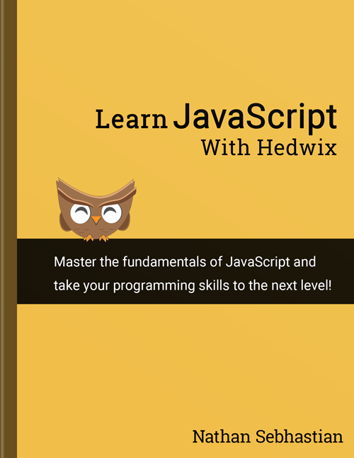

# Learning JavaScript With Hedwix

Copyright © 2019 [Nathan Sebhastian](https://sebhastian.com).

## Motivation

JavaScript has seen a tremendous growth in popularity and opportunity for developers, but there is no learning material that offers a practical and modern way to learn JavaScript. This book is intended for beginner and intermediate developers interested in learning what JavaScript can do, from adding interactivity to web pages, to creating a server with Node.js.

Most JavaScript tutorial starts with learning about how to write JavaScript in the browser. This book will start with writing JavaScript in the console, using Node.js to run the code instead of fiddling with the browser from the start. Only after the basics of JavaScript are covered will the book goes to explain how JavaScript is being used in the browser.

This book offers a more practical approach to writing web application with JavaScript, emphasizing on exercises and projects over theories, to make the readers able to code with JavaScript.

Once you're finished with the book, you can use vanilla JavaScript to add dynamic content into the web and create basic Node.js APIs that can respond to network request by sending data.

If you like to support this project, you can do so by purchasing the digital format of the book at [Leanpub](https://leanpub.com/learn-javascript-with-hedwix) with bonus solution to exercises and projects. The lower price is intended for students and non-working professionals, but it's totally up to you 😄

Thank you for your support and enjoy the book!

## The Content

* Introduction
  * [Preface](manuscript/intro-01.md)
  * [JavaScript introduction](manuscript/intro-02.md)
  * [Setting up your computer](manuscript/intro-03.md)
* Part 1: The Basics of JavaScript
  * [Time to say Hello, World!](manuscript/chapter-01.md)
  * [Code structure](manuscript/chapter-02.md)
  * [Variable](manuscript/chapter-03.md)
  * [Data types](manuscript/chapter-04.md)
  * [Type conversion](manuscript/chapter-05.md)
  * [Operators](manuscript/chapter-06.md)
  * [Control flow statements](manuscript/chapter-07.md)
  * [Switch case conditional](manuscript/chapter-08.md)
  * [Loop statements](manuscript/chapter-09.md)
  * [Functions](manuscript/chapter-10.md)
  * [Object data type](manuscript/chapter-11.md)
  * [Array data type](manuscript/chapter-12.md)
  * [Class](manuscript/chapter-13.md)
  * [Part 1 project and summary](manuscript/chapter-14.md)
* Part 2: JavaScript in the browser
  * [Use of JavaScript in the browser](manuscript/chapter-15.md)
  * [The Document Object Model](manuscript/chapter-16.md)
  * [Handling events](manuscript/chapter-17.md)
  * [Handling Forms](manuscript/chapter-18.md)
  * [Network request and asynchronous programming](manuscript/chapter-19.md)
  * [Project 2 project and summary](manuscript/chapter-20.md)
* Part 3: JavaScript and Node.js
  * [Accessing Node.js's API](manuscript/chapter-21.md)
  * [Part 3 project and summary](manuscript/chapter-22.md)
* Conclusion
  * [Parting words](manuscript/conclusion-01.md)
* Extra JavaScript Knowledge
  * [The old `var` keyword](manuscript/chapter-23.md)
  * [JavaScript lexical guide](manuscript/chapter-24.md)
  * [The proper guide to semicolon in JavaScript](manuscript/chapter-25.md)
  * [The Math object](manuscript/chapter-26.md)
