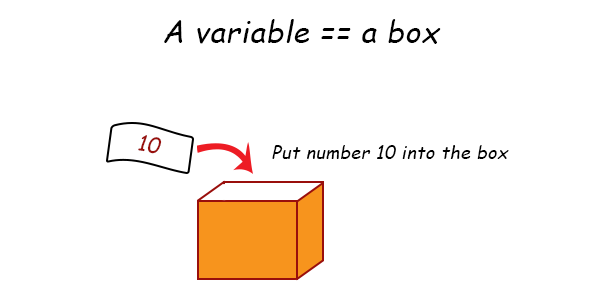
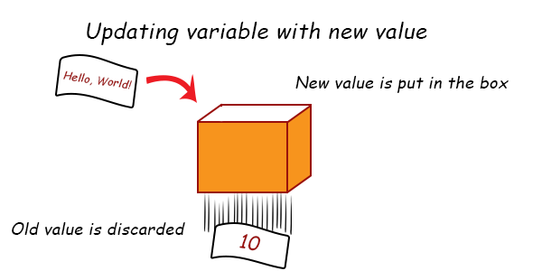

# Variable

A variable is **like a box or container that can hold any kind of value you put into it, but one at a time**. Every programming language had its own way of creating variables. For JavaScript, it is simply using the `let` keyword.

The best way to learn about variables is by doing it, so let's create `chapter-03.js` file with the following content:

```js
let myVariable = 10;
console.log(myVariable);
```

Now run the script. What do you see? The variable `myVariable` is printed out! But why does it print 10? That's because we have assigned that number into our variable! The equal sign `=` is known as assignment operator, and it is used to assign value to variables.



Let's try another one.

```js
let newVariable = 'Hello, World!';
console.log(newVariable);
```

The Console will now print out `Hello, World!` when you run the file.

You can reassign a variable by typing out the variable name followed by another assignment operator. Here is an example of reassigning a variable:

```js
let myVariable = 10;
myVariable = 'Hello, World!';
console.log(myVariable);
```

When you reassign a variable, the old value is discarded and replaced by the new value.



So try making some variables now. you can even do it the old fashioned math way like `let x = 10` and `let y = 5` and then do arithmetic operation on it:

```js
let x = 10;
let y = 5;
console.log(x + y);
console.log(x / y);
```

A variable is used to hold value, and that variable can be used later in your code when you need it. If a variable has more than one word, you can follow the convention and use the camelCase style of writing. You've used it before:

```js
let firstName = 'Nathan';
```

## Constant variable

Sometimes, you might need to declare a variable that doesn't need to change its value for the entire execution of the program. A constant variable is a variable in which the value never changes after it has been declared. To create a constant variable in JavaScript, you can use the `const` keyword:

```js
const COUNTRY = 'United States';
```

To further differentiate between constant and regular variable, a constant is usually written in UPPERCASE format rather than the camelCase format. If the constant name has more than one word, use underscore to join them together:

```js
const MY_COUNTRY = 'United States';
```

Why do we need constant? Good question! It's because sometimes in code, you need arbitrary value that never changes. An example of this is the [Pi](https://www.mathsisfun.com/numbers/pi.html) number in math, which is used to count the area of a circle:

```js
const PI = 3.14;
```

But then again, you might wonder why not just use `let`? That's because a good programming language doesn't want you to accidentally change the constant down the road and causing errors.

## The `var` keyword

In older versions of JavaScript code base, you might encounter the keyword `var` used instead of `let`.

```js
var firstName = 'Nathan';
```

The `var` keyword is used in the same manner as `let`, which is to create mutable variables. So why JavaScript create the new `let` keyword to replace `var`? You can find out more about it at the `var` keyword extra chapter.

## Code exercise

Write a program with three variables, each with the following value:

1. The first variable contain your name
2. The second variable contain your age
3. The third variable contain your occupation

Then print the variables by using three `console.log()` statements. Example output:

```shell
Nathan Sebhastian
27
Software Developer
```
