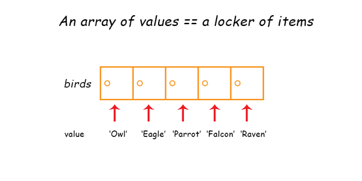
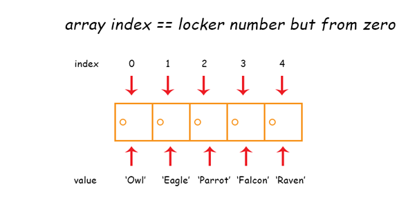

# Array data type

Array is a special data type that can be used to hold more than one values, just like an object. You can think on an array as a list of items each stored inside a locker compartment. An array can be a list of strings, numbers, Boolean values, objects, or a mix of them all.



In order to create an array, you can declare a variable followed by a pair of square brackets, and then put the items inside the brackets separated by comma:

```js
let birds = ['Owl', 'Eagle', 'Parrot', 'Falcon', 'Raven'];
```

You can also declare an empty array without any starting value:

```js
let fishes = []; // empty array is declared
```

An array can also have a mix of values:

```js
let mixedArray = ['Bird', true, false, 3, 10, {name: 'square'}];
```

This array will work just fine.

## Reading array value

You can read and change the value of an array by using its position in the array order. An item position in an array order is also known as _index_, and it **starts from 0**. Going back to our locker example, here is an illustration out of the `birds` array:



Let's try to print the string `Owl` by typing out the name of the array followed by its index wrapped in square brackets:

```js
console.log(birds[0]);
// Owl
```

There you go! You can access and update an array value by using the `arrayName[index]` syntax. Let's replace `Parrot` with `Vulture`:

```js
birds[2] = 'Vulture';

console.log(birds);
// [ 'Owl', 'Eagle', 'Vulture', 'Falcon', 'Raven' ]
```

Don't forget that array index starts from 0, which makes Parrot is on index 2 and not 3.

## Special Methods For Array Manipulation

In JavaScript, array is an object data type with special methods specifically for manipulating array values. Here are some of the most commonly used Array methods:

`push` is used to add an item to the end of an array:

```js
let birds = ['Owl', 'Eagle'];
birds.push('Sparrow');
console.log(birds);
// [ 'Owl', 'Eagle', 'Sparrow' ]
```

`pop` is used to remove an item from the end of an array:

```js
let birds = ['Owl', 'Eagle', 'Sparrow'];
birds.pop(); // remove the last index, in this case Sparrow
console.log(birds);
// [ 'Owl', 'Eagle' ]
```

`unshift` is used to add an item to the front of an array:

```js
let ungulates = ['Bull', 'Pig', 'Horse'];
ungulates.unshift('Cow');
console.log(ungulates);
// [ 'Cow', 'Bull', 'Pig', 'Horse' ]
```

`shift` is used to remove an item from the front of an array:

```js
let ungulates = ['Cow', 'Bull', 'Pig', 'Horse'];
ungulates.shift();
console.log(ungulates);
// [ 'Cow', 'Bull', 'Pig' ]
```

`indexOf` is used to find and return the index of an item in the array. When not found, the method will return `-1` to indicate that the value is nowhere to be found:

```js
let fishes = ['Shark', 'Whale', 'Goldfish'];
let pos = fishes.indexOf('Whale');
console.log(pos); // 1
```

`join` is used to join array items into a single string value. Join can have one optional parameter to separate the values. If there is no parameter given, the values will be separated by comma:

```js
let fishes = ['Shark', 'Whale', 'Goldfish'];
let myFish = fishes.join(' and ');
console.log(myFish);
```

`concat` is used to join two or more arrays into one array:

```js
let birds = ['Falcon', 'Raven'];
let fishes = ['Shark', 'Whale'];
let ungulates = ['Cow', 'Bull', 'Pig'];

let animals = birds.concat(fishes, ungulates);
console.log(animals);
```

`splice` is used to remove items from an array using its index. It accept two parameters: the starting index and the amount of items removed.

```js
let animals = ['Falcon', 'Raven', 'Shark', 'Whale', 'Cow', 'Bull', 'Pig'];

// start from index 2 and remove 3 items
animals.splice(2,3); // remove Shark, Whale and Cow
console.log(animals);
```

For the full list of array methods, you can visit the [Mozilla Documentation](https://developer.mozilla.org/en-US/docs/Web/JavaScript/Reference/Global_Objects/Array#Methods_2)

## Looping An Array

To loop over an array, you can use the `forEach` method, which accept a function parameter that will be executed once for each array item:

```js
let birds = ['Owl', 'Eagle', 'Parrot', 'Falcon', 'Raven'];

birds.forEach(function(item, index, array) {
  console.log(item, index, array);
});
```

A function that is passed as a parameter to another function is called a _callback function_. This function will be executed by the `forEach` method.

## Code exercise

Create an array of colors that includes "red", "green", and "blue".

First, add a "black" color after the last index of the array.

Then remove "red" from the array and swap "green" and "blue" position.

Finally, add "yellow" color to the first index of the array.

Loop over the array and print each item to the console. Here is the example output:

```shell
yellow
blue
green
black
```
