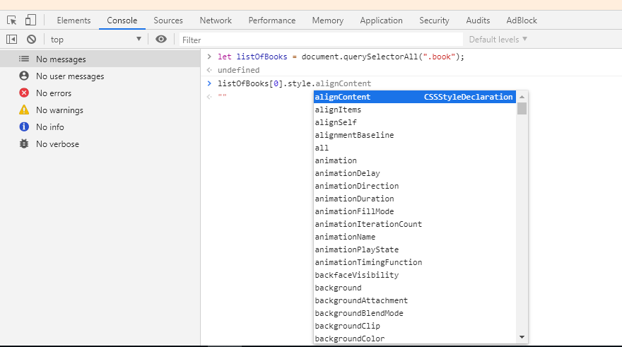

# The Document Object Model

A browser renders an HTML page by creating a nested tree structure composed of tags. In this representation of HTML page, an HTML tag became known as element node (or just node).

[illustration]

This representation of HTML file as a tree structure created from tags are also known as the _Document Object Model_, and they are accessible by JavaScript.

With the DOM, JavaScript can manipulate web page to add and remove nodes, change the styling or attribute of a node. For example, open up your `index.js` file and write the following code:

```js
const head = document.head;
const body = document.body;

console.log(head);
console.log(body);
```

The entire HTML nodes are stored inside the `document` object variable as properties, so you can immediately access the document by calling on the variable.

The `body` object stores all of HTML page tag elements inside the `childNodes` array. Using the `index.html` file as an example, you can try looping over the `childNodes` and log them to see the values:

```js
document.body.childNodes.forEach(function(node){
  console.log(node);
});
```

## DOM query selector and get element

The natural structure of HTML document can have element nodes that are several levels deep because the need of creating semantic web pages. This means accessing nodes using the `document` object can quickly become frustrating when you have multiple level `childNodes`. Going back to the example, in order to access one of `<li>` elements that list the book title, you need to go down from the `document` object in the following manner:

```js
console.log(document.body.childNodes[5].childNodes[5].childNodes[1].innerHTML);
```

Fortunately, there are easier ways to access HTML nodes. You can use the DOM `querySelector()`, which gets the first element node that matches the HTML attribute you specified in the argument of the function. Here is an example of getting the entire book list `<ul>` element that contains the title of the books using its class attribute:

```js
document.querySelector(".book-list");
```

That means you can get the `<li>` element by using its class attribute:

```js
document.querySelector(".book");
```

But hold on, what about getting the second or fourth `<li>` element? Since `querySelector` returns the first matching node, you need to use `querySelectorAll`, which returns all nodes matching the CSS selector as an array:

```js
let listOfBooks = document.querySelectorAll(".book");
console.log(listOfBooks[2]); // The Prisoner of Azkaban
console.log(listOfBooks[4]); // The Order of the Phoenix
```

The query selector isn't the only method that you can use to access certain nodes. You can also use `getElementById`, which returns the node that has the matching `id` attribute you specified as argument:

```js
document.getElementById("header");
document.getElementById("tagline");

// query selector equivalent
document.querySelector("#header");
document.querySelector("#tagline");
```

And then there is `getElementsByClassName`, notice the plural `Elements`, which means this method can return more than just one value, which also means it will return the result as an array:

```js
document.getElementsByClassName("book");
```

So yeah, this is how you can navigate around the `document` object and pick a certain node out for manipulation. In order to make it easier, you need to learn how to name HTML elements with `id` and `class` attributes. Once you have them in place, you can select them easily using query selector or get element by attribute method.

## Manipulating element nodes

Now that you have learned about query selector, let's use it to manipulate the element nodes and modify some of their attributes. You're going to change the list of Harry Potter series into a list of The Chronicles of Narnia series. Let's change the series name `<h2>` element first:

```js
document.querySelector('#series-name').innerHTML = 'The Chronicles of Narnia Series';
```

`innerHTML` is a property of `document` object's element node. What's the value of an `innerHTML`? Everything between the opening and closing HTML tag, so in the case of the series name, it's `The Harry Potter Series` text. In order to change the value of `innerHTML`, you can simply reassign it to a new value, just like any other object property.

```js
document.getElementById('series-description').innerHTML = 'The list of Narnia book series';
```

Next, let's remove the list of Harry Potter books `<ul>` element. You can do so by using the `remove()` method:

```js
document.querySelector('.book-list').remove();
```

Now you can learn how to add elements into the node tree through `insertAdjacentHTML` method. This method accept two parameters: _position_ and _value_. The _position_ argument has to be one of the 4 defined position value, while the _value_ argument can be any valid HTML element. The 4 valid position values are as follows:

* "afterbegin" - Insert _value_ argument as the first child element of the selected element
* "beforeend" - Insert _value_ argument as the last child element of the selected element
* "afterend" - Insert _value_ argument next to the selected element
* "beforebegin" - Insert _value_ argument before the selected element

Let's see it in action. First, select the element closes to where you want to put the new element. In this case, the `<ul>` with `id` of `series-name`:

```js
let seriesName = document.querySelector('#series-name');
seriesName.insertAdjacentHTML('afterend', "<ul class='book-list'></ul>");
```

Great! next, insert a child element using the `afterbegin` position:

```js
let bookList = document.querySelector('.book-list');
bookList.insertAdjacentHTML('afterbegin', "<li class='book'>The Magician's Nephew</li>");
```

You now have the first child of `<ul>` in place. Since the next child element will be below the first, you need to use the `beforeend` position. Using `afterbegin` will place the next child element above the first one:

```js
bookList.insertAdjacentHTML('beforeend', "<li class='book'>The Lion, the Witch, and the Wardrobe</li>");
```

You can insert the rest of the `<li>` elements the same way:

```js
bookList.insertAdjacentHTML('beforeend', "<li class='book'>The Horse and His Boy</li>");
bookList.insertAdjacentHTML('beforeend', "<li class='book'>Prince Caspian</li>");
bookList.insertAdjacentHTML('beforeend', "<li class='book'>The Voyage of the Dawn Treader</li>");
bookList.insertAdjacentHTML('beforeend', "<li class='book'>The Silver Chair</li>");
bookList.insertAdjacentHTML('beforeend', "<li class='book'>The Last Battle</li>");
```

You now have a list of The Chronicles of Narnia series in place of The Harry Potter series. Great job!

## Modifying element styles

JavaScript can also be used to add styling to element nodes, because each element node has its own `style` object.

```js
let listOfBooks = document.querySelectorAll(".book");
listOfBooks[0].style.fontSize = '14px';
listOfBooks[0].style.backgroundColor = 'aqua';
listOfBooks[1].style.fontSize = '18px';
listOfBooks[1].style.backgroundColor = 'grey';
listOfBooks[2].style.fontSize = '22px';
listOfBooks[2].style.backgroundColor = 'yellow';
listOfBooks[3].style.fontSize = '26px';
listOfBooks[3].style.backgroundColor = 'hotpink';
listOfBooks[4].style.fontSize = '12px';
listOfBooks[4].style.backgroundColor = 'lightblue';
listOfBooks[5].style.fontStyle = 'italic';
listOfBooks[5].style.backgroundColor = 'beige';
listOfBooks[6].style.color = 'white';
listOfBooks[6].style.backgroundColor = 'indigo';
```

For the full list of available properties in the `style` object, you can refer to this [documentation](https://www.w3schools.com/jsref/dom_obj_style.asp). But instead of memorizing all of it, you can use the autocompletion feature of your browser to help you in manipulating the style:



Alternatively, you can also create a `<style>` tag and append it to the document `<head>` like this:

```js
let style= `
  html {
    background-color: red;
  }
`;
document.head.insertAdjacentHTML("beforeend", `<style>${style}</style>`);
```

You can write as many CSS style as you need into the `style` variable and then put it into the `<style>` script tag. This is far easier when creating a style for the whole document instead of using the `style` object.

## Code exercise

Do the [Mozilla Web page](https://github.com/mdn/beginner-html-site-styled), but add all extra elements and style using JavaScript. Use this HTML page as your starting point:

```html
<!DOCTYPE html>
<html>
<head>
  <meta charset="utf-8">
  <title>JavaScript in the Browser</title>
</head>
<body>
  <script src="index.js"></script>
</body>
</html>
```

Here's a few hints:

* You can open the [live example](http://mdn.github.io/beginner-html-site-styled/) of the repository and then view its source. That way you will know the HTML structure and add them into your HTML page appropriately.
* To view page source in Google Chrome, right click anywhere on the page and click "View page source". Alternatively you can use the shortcut `CTRL + U`.
* While in the page source, click on the `style.css` to view the implemented CSS rules. Add them inline using the `style` object into the appropriate elements. Use what you have learned in this chapter about selecting, modifying and styling element nodes.

Don't forget to put all your JavaScript code into the `index.js` file. You can add your own id and class to make it easier to select elements with JavaScript.