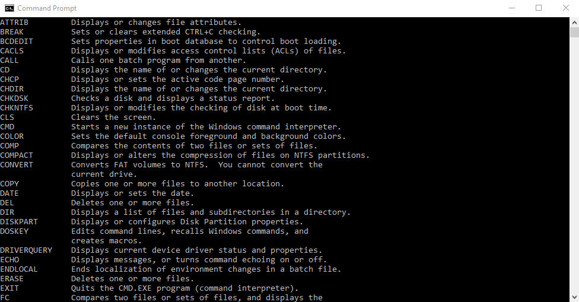
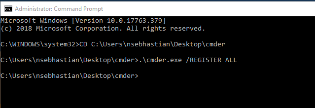
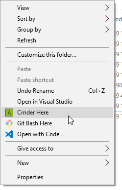

# Setting up your computer

In order to write a program with JavaScript, you need to install a few free tools. They are available for all operating systems, so you can use any operating system you already have.

The first tool to install is Visual Studio Code

## Installing VSCode

Visual Studio Code, or VSCode is a program specially created for the purpose of writing code. Aside from being free, VSCode is open source and run on all Operating System, so you can use it on Windows, macOS, and Linux just fine. If you didn't have any text editor already available, I recommend you to install VSCode by going to its website.

You will find the guide to installing and a mini tour of VSCode features [here](https://sebhastian.com/vscode-guide)

Now that you have the software to write JavaScript code, you now need a software to run JavaScript code. Let's install Node.js next.

## Installing Node.js

JavaScript was born with the purpose of making websites interactive. It was made so that you can add some code that will be run when a button is clicked, and it has served that purpose well. Web browsers implemented JavaScript to its engine, and thus JavaScript lives only in the browser.

But in 2009, A software engineer by the name of Ryan Dahl invented Node.js, A program that can run JavaScript outside of the browser. This invention enables JavaScript developers to write command line tools and server side code in JavaScript.

I won't go into the technical details of how Node.js works, the practical benefit of the invention of Node.js for you and me as developers is that now we can write JavaScript code for almost everything. Let's try it out now.

Simply go into Node's website at [nodejs.org](https://nodejs.org) and download the latest LTS version. Once the download is complete, install it into your system by following the installation wizard.

To try out Node.js, open a command line terminal and type the following code

```shell
node -v
```

It will output the version of your freshly installed Node.js into the console.

## Installing cmder (for Windows only)

Learning to code requires you to use the command line often, and unlike macOS or Linux, Windows vanilla command line console, the Command Prompt, is kind of old and doesn't have a good syntax highlighter. It's all black and white.



Cmder (read commander) is a software created to provide great console experience for Windows. I really love to use it, so I recommend you to install it too.

All you have to do is go to the cmder website and download a zip file. Once the download is finished, unzip the file and then open the cmder.exe file.

### Open cmder through context menu shortcut

This step is optional, but you can add cmder into your context menu (the one you open by right clicking on a folder or a file) for easier access. Here is how to do it:

1. Open a Command Prompt as an Administrator
2. Navigate to the directory you have placed Cmder
3. Execute `.\cmder.exe /REGISTER ALL` If you get a message "Access Denied" ensure you are executing the command in an Administrator prompt.



Now you have the `Cmder Here` context menu when you right click on a folder.



## Quick Console Introduction

The Console is a program that allows you to type and issue commands to your computer. It has different names, and some people might call it the Terminal, the Command Prompt, but whatever they are called, they refer to the same thing: a tool that allows you to give instruction to your computer by entering specific commands.

You're not going to use all the commands available within the Console, in fact, you only need to know 5 basic commands that helps you navigate the system.

First, open your command line Terminal, or cmder if you're on windows, then type `pwd` and hit enter:

```shell
pwd
```

This is the command you use to find out in which directory your terminal is currently on. In order to change directory from the one you're currently in, use the `cd` command:

```shell
cd directory/directory
```

You can move up a directory by using the `..` command:

```shell
cd ..
```

For going up more than one directory, use `../..`.

To clear your console from previous output, use the `clear` command:

```shell
clear
```

To print out the list of files in a directory, use the `ls` command:

```shell
ls
```

To create a new file, use the `touch` command followed by the file name and its extension:

```shell
touch javascript.js
```

To create a new directory, use the `mkdir` command followed by the name of the directory:

```shell
mkdir my_project
```

There are lots of things you can do with the command line, but these six commands would be enough for this tutorial.

The command line can also run software, as you've done previously by issuing `node -v` command. You're going to use node to run JavaScript code from the console, as you'll see in the next chapter.

Great! Now you are ready to start learning about JavaScript basics.